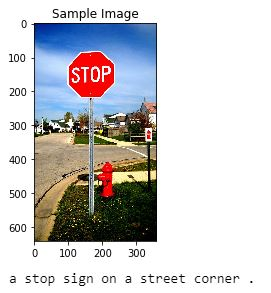

# Image-Captioning

Using [COCO dataset](http://cocodataset.org/#home) with the [COCO API](https://github.com/cocodataset/cocoapi), a CNN encoder and a RNN decoder,\
we will  implement an image captioning project as explain in this [paper](https://arxiv.org/pdf/1502.03044.pdf).

The project can be summarized as follows:

In order to provide accurate image captioning:

