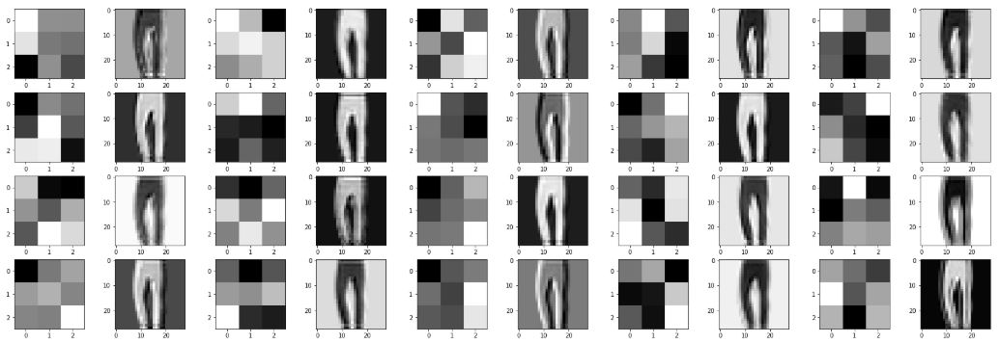

# Getting-started-with-PyTorch

## Fashion-MNIST tutorial

Using a convolutional neural network to classify Fashion MNIST dataset and check out layer outputs.

Dataset can be found [here](https://www.kaggle.com/zalando-research/fashionmnist).

## Transfer Learning tutorial

Using transfert learning (DenseNet) to build a binary classifier.

Dataset can be found [here](https://www.kaggle.com/tongpython/cat-and-dog).

## Character-Level-LSTM-in-PyTorch

Use 2 layers LSTM network trained over 25 epochs to generate text based on the book Notre-Dame de Paris from Victor Hugo.

Online books can be found on this useful [website](http://www.gutenberg.org/wiki/Main_Page) and the original work on this subject can be find [here](http://karpathy.github.io/2015/05/21/rnn-effectiveness/)
with the PyTorch implementation [here](https://github.com/karpathy/char-rnn).

