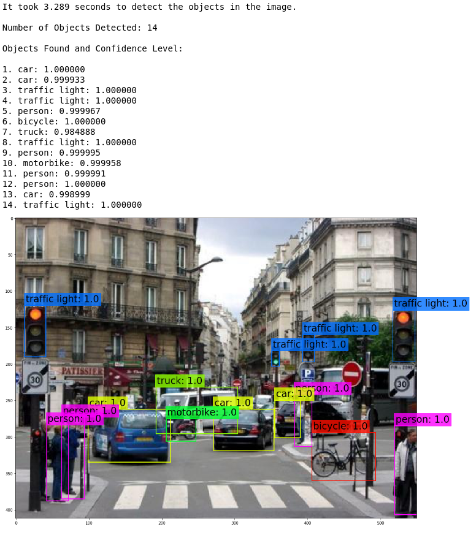

# YOLOv3-implementation

How to implement a non trainable version of [YOLOv3](https://pjreddie.com/media/files/papers/YOLOv3.pdf) based on 80 objects available on [COCO dataset](http://cocodataset.org/#explore).

`YOLO.ipynb` contains the detailed implementation. 

Weights file and more information about YOLOv3 can be find [here](https://pjreddie.com/darknet/yolo/)

